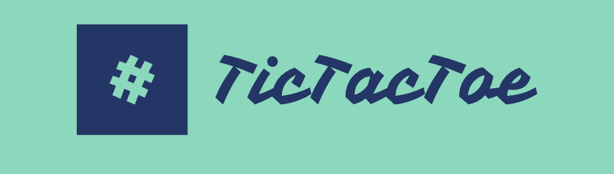
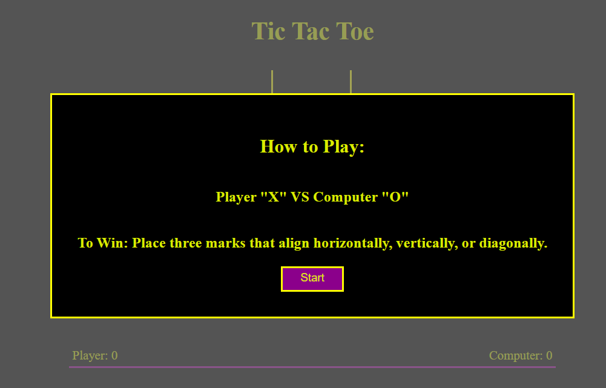
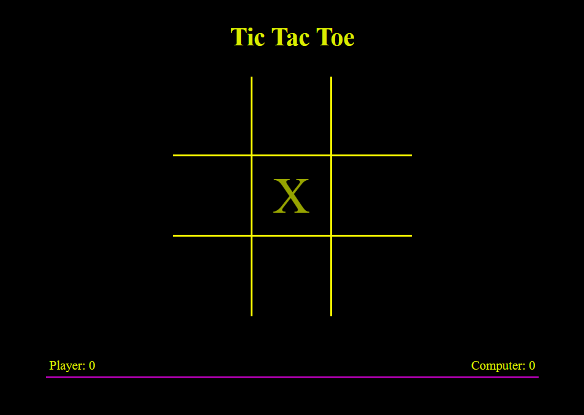
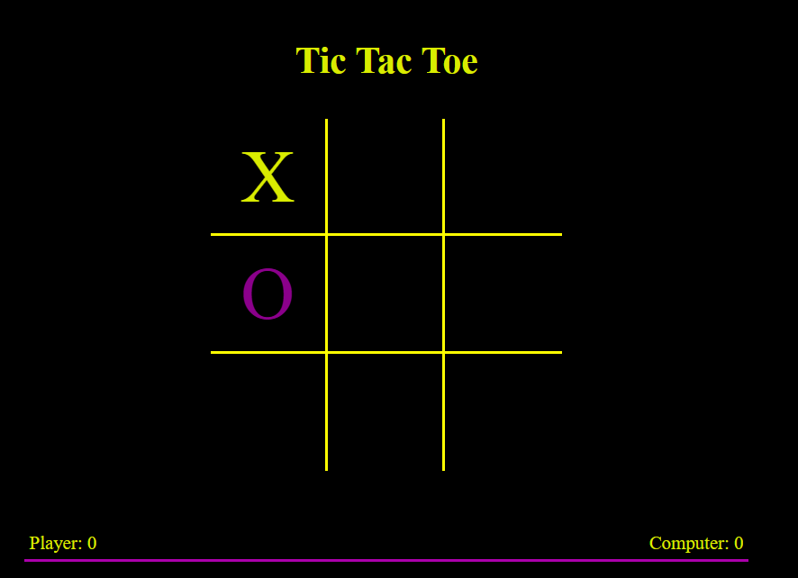
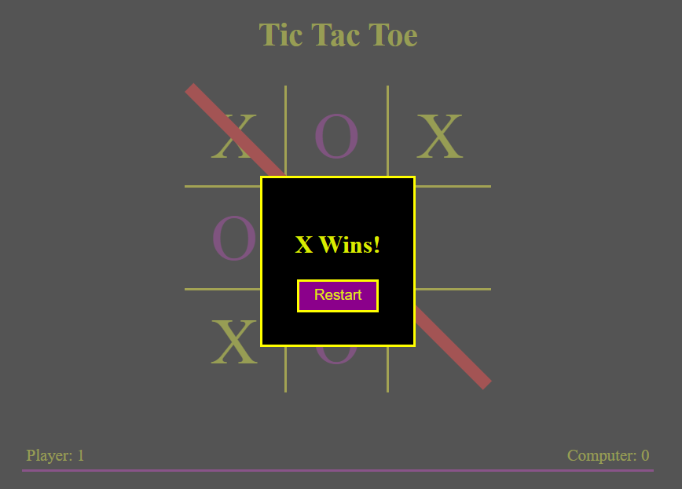
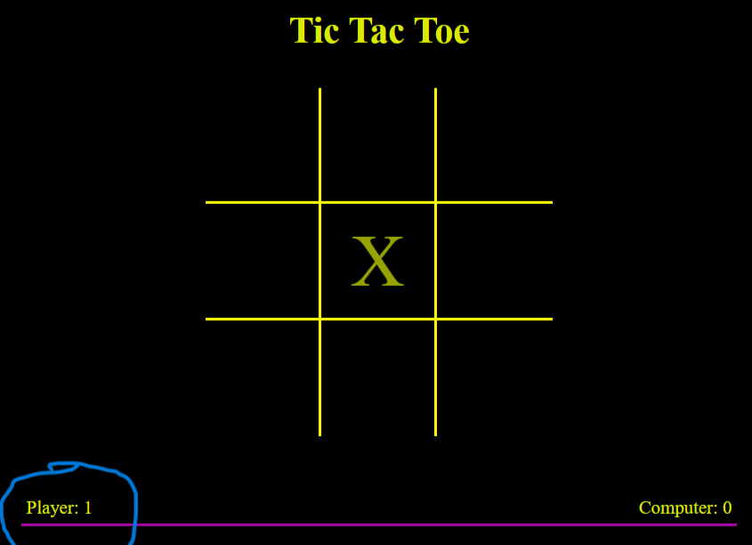
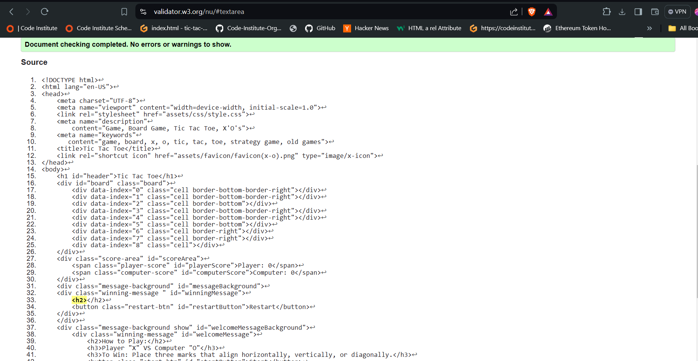
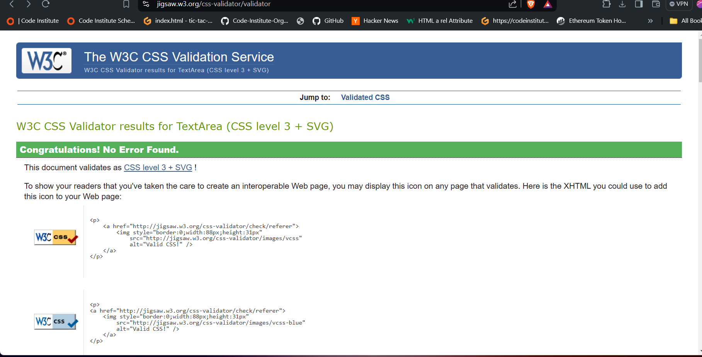
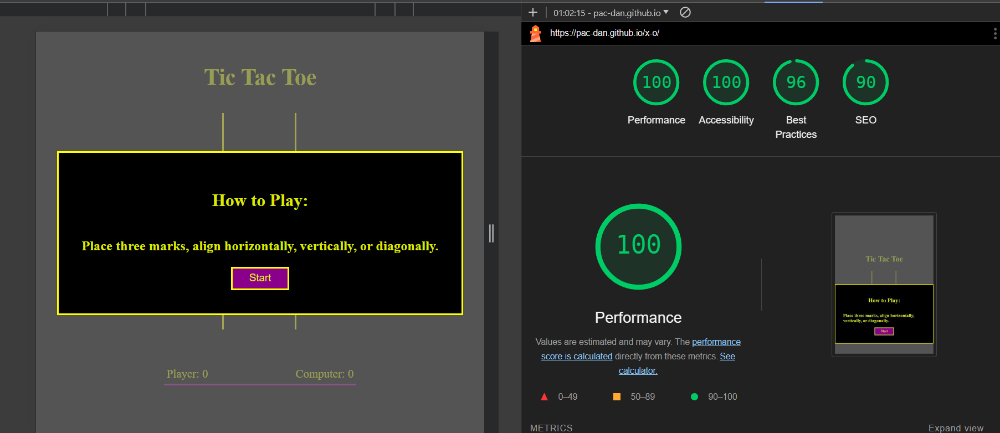
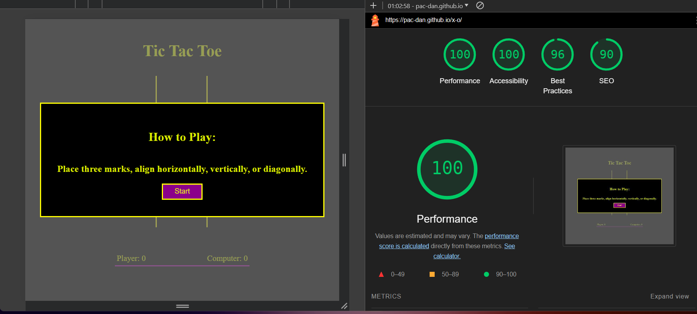

# TIC TAC TOE BOARD GAME

Welcome to my Tic Tac Toe Game!A fully functioning board game where the player "X" can play against the computer "O".
with the computer placing completely random marks in the game it keeps every game fair!

Users of this game will learn how to strategize against the computer as they place their starting "X" mark in a different cell each game, with the computer placing truely random marks after each players turn this trains the player for all possible strategies.

This Game is designed to be simple and fun, and have that old school look to it.

# Features 

1. **Existing Features**

   - **Welcome Message:** A brief Introduction to the Tic Tac Toe Game, explaining the rules and how to play.
   - **Start Button:** Clear Start Button under Welcome Message.
   - **Bright Colored Boarders:** A captivating simple screen to engage visitors right from the start.
   
   

   - **Game Board:** The main game board where players interact and play against the computer.
   - **Score Area:** Keeps tabs on players scores
   - **Hover Function:** Shows current players mark inside a hovered over cell. 

  

2. **Game Board**
  - **Game Options:** The User will start as "X", the computer will then return a move at random of "O". It will then go back to the User until there is a winner or a draw.

  

3. **End Of Game** 
  - **Game Results:** The User will see an End Game screen once either the Computer or User wins or there is a draw. This screen informs who the winner is and a red strike goes though where the winning strike was.
  - **Restart Button:** Beneath the End Game message is a very clear Restart Button, which clears the board and sets the turn back to the User (Player: "X").

  

4. **Board Reset**
  - **Clear Board and add score to winner**

  

5. **Responsive Design**

   - **Mobile-Friendly Layout:** The website is fully responsive and optimized for mobile devices, ensuring a seamless experience on smartphones and tablets.

6. **Custom Styling (style.css)**

   - **Consistent Branding**: The website uses a consistent color scheme, typography, and branding elements to create a professional and cohesive look.
   - **User Experience Enhancements**: CSS animations and transitions improve user interaction and make the website more engaging.

## Testing 

In this section, you need to convince the assessor that you have conducted enough testing to legitimately believe that the site works well. Essentially, in this part you will want to go over all of your project’s features and ensure that they all work as intended, with the project providing an easy and straightforward way for the users to achieve their goals.

In addition, you should mention in this section how your project looks and works on different browsers and screen sizes.

You should also mention in this section any interesting bugs or problems you discovered during your testing, even if you haven't addressed them yet.

If this section grows too long, you may want to split it off into a separate file and link to it from here.

### Validator Testing 

  - **HTML**
  - No errors were returned when passing through the official W3C validator.

  - **CSS**
  - No errors were found when passing through the official (Jigsaw) validator

## Deployment

- The site was deployed to GitHub pages. The steps to deploy are as follows: 
  - In the GitHub repository, navigate to the Settings tab 
- Click Pages, Find Build and Deployment, select 'source'-'deploy from a branch'.
- Find 'Select Branch'-'Main Branch' Click save.
- Project now deployed and updates to new version when changes are pushed from gitpod --> github.

The live link can be found here - https://pac-dan.github.io/x-o/

## Credits 

https://www.w3schools.com/ 
https://learn.codeinstitute.net/courses
https://courses.webdevsimplified.com/

### Content 

- I took inspiration from the love maths website and then used to find useful html/css/javascript tags -- https://

www.w3schools.com/

- I also asked many questions amongst friends who are in the course and outside of the course. 
- My mentor helped me to understand how to build such a game
- I have also watched tonnes of videos and tried to build a bunch of games from channels like 

https://courses.webdevsimplified.com/

### Media

**Favicon** - https://www.flaticon.com/free-icon/crosses_13537033?term=tic+tac+toe&page=1&position=14&origin=tag&related_id=13537033

## testing table

| action                                             |exp. behavior                           |pass / fail |
|----------------------------------------------------|----------------------------------------|------------|
|Click Start Button                                  |Show Game Board                         |   pass     |
|Click cell                                          |Place "X" mark                          |   pass     |
|Computer places mark                                |Computer places "O" mark after "X"      |   pass     |
|Check win	Display                                  |Check for all Win Patterns/Strikes      |   pass     |
|Check draw                                          |Check for a draw                        |   pass     |
|Restart game                                        |Resets Game Board                       |   pass     |
|Hover over cell                                     |Show current players mark in cell       |   pass     |
|Update player score                                 |if User wins +1 to Player Score         |   pass     |
|Update computer score                               |if Computer wins +1 to Computer score   |   pass     |

**lighthouse testing**

**Mobile Testing**

**Desktop Testing**

**Bugs**
- Initially i was getting an extra turn for O as i had not properly defined the computerMove in the swapTurn statement within the handleClick function, by adding the computermove and a timeout i resolved this issue.

**Unfixed Bugs**
- No Unfixed Bugs